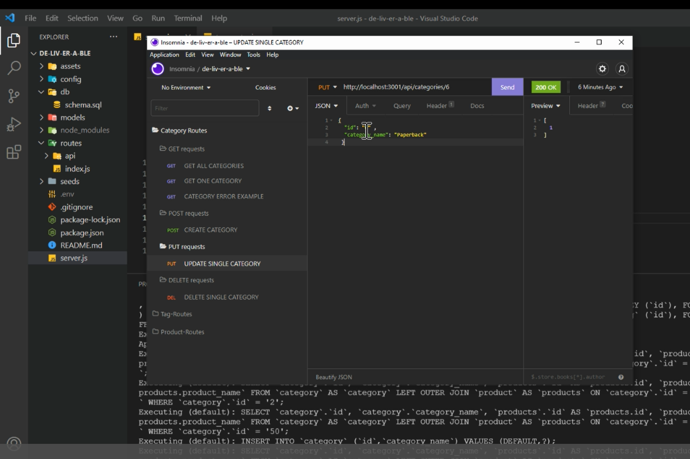

  
  # de-liv-er-able
  

  ## Description
  de-liv-er-able is a back-end site for an E-Commerce business that works with Express.js and uses Sequelize to interact with a MySQL database. Users can view and update the database by using Insomnia, a RESTful API client.

  ## Preview
  
  See a [walk-through](https://drive.google.com/file/d/1s-GXB09u16nVSydFb9HzEqFWWSLXH0Dj/view) of the application at work!

  ## Table of Contents
  * [Installation](#Installation)
  * [Usage](#Usage)
  * [Credits](#Credits)
  * [License](#License)
  * [Contributions](#Contributions)
  * [Test](#Test)
  * [Questions](#Questions)
  

  ## Installation
  User must have Node.js and MySQL on their device; the application is run through the command line. It is suggested to have a tool such as Insomnia or Postman to view GET/POST/PUT/DELETE requests.

  ## Usage
  To use, open application in VSC or other editor. In the terminal, login to mysql using password, then SOURCE db/schema.sql. Then quit mysql and use command line to type `npm run seed` to populate database with seeds. Using `npm start` the user can then run GET, POST, PUT, and DELETE requests in Insomnia (or other tool like Postman) to make changes to the database.
  
  Rather than needing to write SQL queries in the command line, Sequelize runs the JavaScript seed files to create the tables from which users can view, update, and delete data.

  ## Credits

  This application would not be possible without the following technology:
  * Node.js
  * Visual Studio Code
  * Insomnia
  
  *NPM PACKAGES:*
  MySQL2, Sequelize, dotenv, Express.js

  *Starter code from @fantastic-umbrella.*

  🙌 Gratitude to @Metelak and @Kyler-Mclachlan for their wisdom and guidance!

  ## License
  
  
  ### MIT License

  Copyright 2022 Claire Rosenfrisk

  Permission is hereby granted, free of charge, to any person obtaining a copy of this software and associated documentation files (the "Software"), to deal in the Software without restriction, including without limitation the rights to use, copy, modify, merge, publish, distribute, sublicense, and/or sell copies of the Software, and to permit persons to whom the Software is furnished to do so, subject to the following conditions:
      
  The above copyright notice and this permission notice shall be included in all copies or substantial portions of the Software.
      
  THE SOFTWARE IS PROVIDED "AS IS", WITHOUT WARRANTY OF ANY KIND, EXPRESS OR IMPLIED, INCLUDING BUT NOT LIMITED TO THE WARRANTIES OF MERCHANTABILITY, FITNESS FOR A PARTICULAR PURPOSE AND NONINFRINGEMENT. IN NO EVENT SHALL THE AUTHORS OR COPYRIGHT HOLDERS BE LIABLE FOR ANY CLAIM, DAMAGES OR OTHER LIABILITY, WHETHER IN AN ACTION OF CONTRACT, TORT OR OTHERWISE, ARISING FROM, OUT OF OR IN CONNECTION WITH THE SOFTWARE OR THE USE OR OTHER DEALINGS IN THE SOFTWARE.
  

  ## Contributions
  Please email or comment @crosenfrisk on GitHub. Feel free to Star or Fork to make your own copy and modify as desired.

  ## Test
  Run API routes, if errors occur, follow advise of command line.

  
  ## Questions
  If you have any questions about this project, please contact me directly at claire.rosenfrisk@gmail.com. You can view more of my work on 
   [My GitHub Profile](https://github.com/crosenfrisk).

